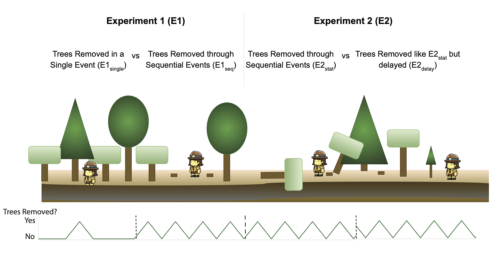

```{r setup, include=FALSE}
knitr::opts_chunk$set(echo = FALSE)
library(markovchain)
library(dplyr)
library(tidyverse)
```
```{css, echo=FALSE}
pre {
  max-height: 500px;
  max-width: 1000px;
  overflow-y: auto;
}

pre[class] {
  max-height: 500px;
}
```

## Markov Chains!
From the "markovchain r doc" and "An Intro to markovchain Package"
```{r plot_test, echo=FALSE, eval=TRUE, fig.height=6, fig.width=8, fig.align='center'}
df <- read.csv('proj_newcode2_20210419.csv')
df$ACRES <- as.numeric(df$ACRES)
prob_mat <- createSequenceMatrix(df$GEN_ACTIVITY, toRowProbs = TRUE, sanitize = TRUE)
seq_states <- unique(df$GEN_ACTIVITY)

seq_states2 <- c("A2-NRH-FH", "A2-RH-FH", "A2-RH-NFH", "EA-NRH-FH", "EA-NRH-NFH", "EA-RH-FH", "EA-RH-NFH", "HARV_NOSTOCK", "INT_CUT", "LAND_CLEAR", "SPEC_PROD_REMOVE", "UA-RH-FH")
seq_states2

markov2 <- new('markovchain', 
               transitionMatrix = prob_mat,
               states = seq_states2)
layout <- matrix(c(-2,-2, 0,2.5, -2,0, 2,1.5, 0,-2, -2,2, 2.5,2, 2,-2, 0,0, -1,1, 1,1, 1,-1), ncol = 2, byrow = TRUE)
plot(markov2, edge.arrow.size=0.5, vertex.size=10, vertex.label.cex = 0.5, edge.label.cex=0.75,
     vertex.color="green", edge.arrow.mode = 3, layout=layout)
```

## Motivation 

- Need to set up a "typical" logging sequence in southern Idaho 

```{r logseq_img, echo=FALSE, eval=TRUE, fig.align='center', fig.cap="Logging Scenarios"}

```


## What is a Markov Chain?

Discrete Time Markov Chain = sequence of random variables $$X_1, X_2,...,X_n...$$ Characterized by the Markov process

which is "memoryless", the distribution of the future state $X_{n+1}$ depends only on current state $X_n$ 

## What is a Markov Chain?

The chain moves from one step to another (i.e. the 'transition' or 'step')

State space is the set of possible states $S = {s_1,s_2,...s_r}$. These states can be infinite or countable

Probability of $p_{ij}$ to move from state $s_i$ to state $s_j$ in one step is the transition porbability

$p_{ij} = Pr(X_1 = s_j|X_0 = s_i)$

## What is a Markov Chain?

Distribution of transitions from one state to another represented in transition matrix

Each element of poistion $(i,j)$ represents the transtion prob $p_{ij}$

$$ P = \begin{bmatrix}p_{11} & p_{12} & p_{13}\\
p_{21} & p_{22} & p_{23}\\
p_{31} & p_{32} & p_{33}
\end{bmatrix}$$

## The Package

There is a package in r (for everything) for Markov Chains called...markov chain.

- library(markovchain)
- library(dplyr)
- library(tidyverse)

## The Data

Load in the data. In this case the data has the following variables:

- NEPA project name
- GEN_ACTIVITY - general activity, basic definition of activity based on Forest Service objective
- Date Completed
- Acres
- SEQ_DAYS/SEQ_INT - sequence days, the number of days between activities (date/integer)
- SEQ_ACTIVITY - sequence activity, a new category, "activity to activity"

```{r data, echo=FALSE, eval=TRUE}
df <- read.csv('proj_newcode2_20210419.csv')
df$ACRES <- as.numeric(df$ACRES)
```


## Basic Process (I think??)
1. From data create a transition matrix
2. Fram data create a vector of states
3. Create a new Markov Chain
4. Sample Markov Chain

## Create transition matrix

```{r trans_mat, echo=TRUE, eval=TRUE}
prob_mat <- createSequenceMatrix(df$GEN_ACTIVITY, 
            toRowProbs = TRUE, sanitize = TRUE)
prob_mat
```

## Create vector of states

```{r states, echo=TRUE, eval=TRUE}
seq_states <- unique(df$GEN_ACTIVITY)
seq_states
```

## Create vector of states (put in alpha order)

```{r states_2, echo=TRUE, eval=TRUE}
seq_states2 <- c("A2-NRH-FH", "A2-RH-FH", "A2-RH-NFH", "EA-NRH-FH", "EA-NRH-NFH", "EA-RH-FH", "EA-RH-NFH", "HARV_NOSTOCK", "INT_CUT", "LAND_CLEAR", "SPEC_PROD_REMOVE", "UA-RH-FH")
seq_states2
```

## Create a new Markov Chain

```{r new_mc, echo=TRUE, eval=TRUE}
mc_tmp <- new("markovchain", 
                states = seq_states2,
                transitionMatrix = prob_mat)

mc <- as(mc_tmp, "data.frame")
print(head(mc))
```

## Can sample from Markov Chain 

```{r seq_sim, echo=TRUE, eval=TRUE}
seq_sim <- rmarkovchain(5, mc_tmp, "data.frame", t0 = "INT_CUT")
seq_sim
```

## Can repeat many times? Any common patterns?

```{r seq_sims, echo=TRUE, eval=TRUE}
seq_sims <- replicate(20, {
  sequence <- rmarkovchain(5, mc_tmp, "data.frame", t0 = "INT_CUT") 
})
seq_sims
```

## Moving Forward

- Still don't fully understand "under the hood"
- Still don't understand time and timing 
  - really to to know the transition times from one state (activity) to another